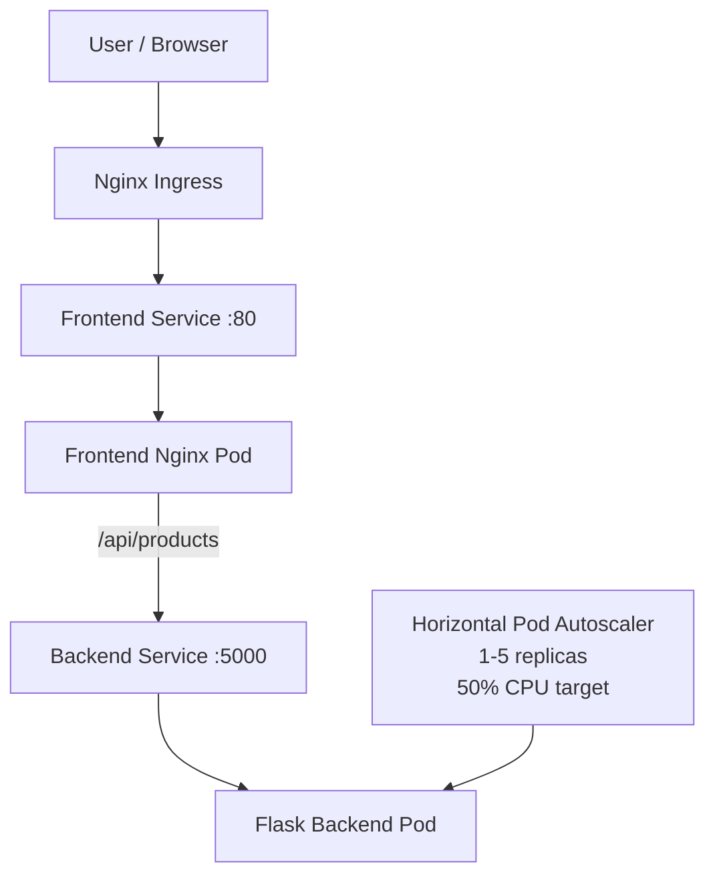
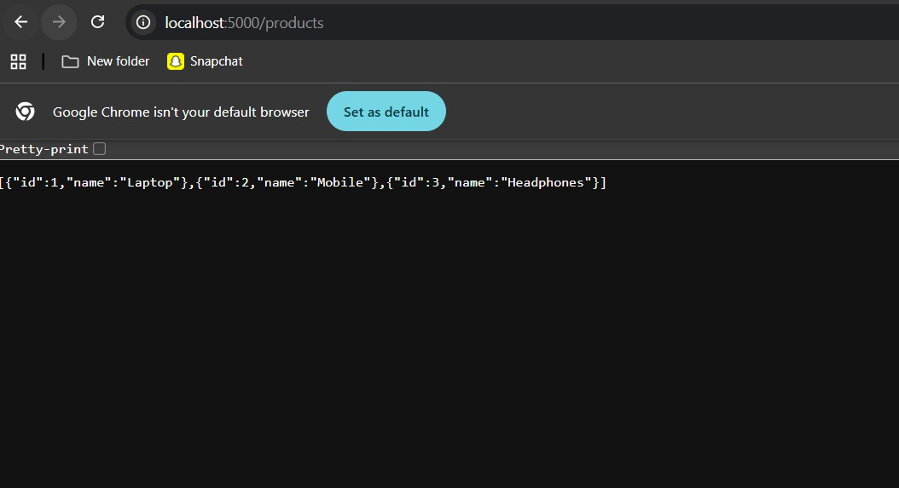
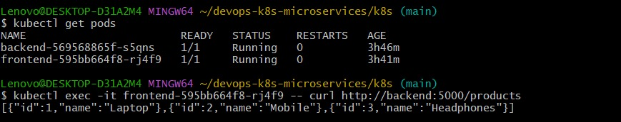
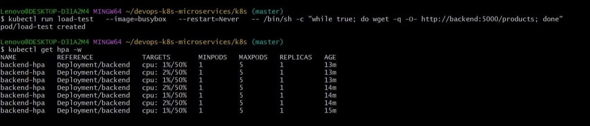
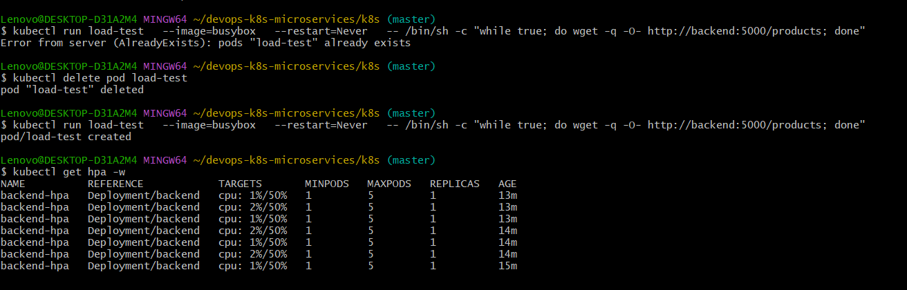

# ☸️ Dockerized Kubernetes Microservices with HPA & Nginx Ingress

A hands-on container orchestration project that demonstrates how a **frontend and backend microservice application** can be containerized with Docker and deployed on Kubernetes with **Services, Ingress routing, health probes, resource limits, and Horizontal Pod Autoscaling (HPA)**.

The project runs locally using Docker Compose and can also be deployed to a Kubernetes cluster such as **kind**.

---

## 📌 Project Overview

This project contains two independent services:

- **Frontend:** Nginx serving a simple web UI
- **Backend:** Python Flask REST API exposing product data

The frontend communicates with the backend through an Nginx reverse proxy.

In Kubernetes, the application uses:

- Deployments
- Services
- Nginx Ingress
- Liveness and readiness probes
- Resource requests and limits
- Horizontal Pod Autoscaler

> **Note:** This project does not use a real database. Product data is returned directly by the Flask backend as sample in-memory data.

---

## 🏗 Architecture



### Application Request Flow

```text
Browser
   │
   ▼
Kubernetes Ingress
   │
   ▼
Frontend Service :80
   │
   ▼
Nginx Frontend Pod
   │
   │  GET /api/products
   ▼
Backend Service :5000
   │
   ▼
Flask Backend Pod
   │
   ▼
Product JSON Response
```

The frontend Nginx container proxies requests from:

```text
/api/products
```

to the Kubernetes backend service:

```text
http://backend:5000/products
```

---

## 🧰 Technology Stack

| Technology | Purpose |
|---|---|
| Docker | Containerizes frontend and backend services |
| Docker Compose | Runs both services locally |
| Kubernetes | Orchestrates the application containers |
| kind | Provides a local Kubernetes cluster |
| kubectl | Manages Kubernetes resources |
| Nginx | Serves the frontend and proxies API requests |
| Flask | Provides the backend REST API |
| Kubernetes Services | Provides stable networking between pods |
| Nginx Ingress | Routes external traffic to the frontend service |
| HPA | Scales backend replicas based on CPU utilization |
| Liveness Probe | Detects unhealthy backend containers |
| Readiness Probe | Prevents traffic reaching unready backend pods |

---

## 🐳 Docker Architecture

Both services are independently containerized.

### Frontend

The frontend uses:

```text
nginx:alpine
```

It serves the static application and proxies API traffic to the backend.

```text
Browser
   │
   ▼
Nginx
   │
   ├── /            → Frontend UI
   │
   └── /api/*       → Backend service
```

### Backend

The backend uses:

```text
python:3.10-slim
```

and runs a Flask API on port `5000`.

Available endpoints:

| Endpoint | Purpose |
|---|---|
| `/` | Confirms the backend is running |
| `/products` | Returns sample product data |

Example response:

```json
[
  {
    "id": 1,
    "name": "Laptop",
    "price": 1000
  },
  {
    "id": 2,
    "name": "Mobile",
    "price": 600
  },
  {
    "id": 3,
    "name": "Headphones",
    "price": 120
  }
]
```

---

## 🔄 Local Development with Docker Compose

The repository contains a `docker-compose.yml` file for running both services locally.

### Start the application

```bash
docker compose up --build
```

### Local ports

| Service | Host Port | Container Port |
|---|---:|---:|
| Frontend | 8081 | 80 |
| Backend | 5001 | 5000 |

Open the frontend at:

```text
http://localhost:8081
```

---

## ☸️ Kubernetes Components

### Frontend Deployment

The frontend deployment runs the Nginx application container.

Configured resources:

```text
CPU request:    50m
CPU limit:      200m
Memory request: 64Mi
Memory limit:   128Mi
```

### Frontend Service

The frontend is exposed through a Kubernetes `NodePort` Service:

```text
Service port: 80
Target port:  80
```

### Backend Deployment

The backend deployment runs the Flask API.

Configured resources:

```text
CPU request:    100m
CPU limit:      500m
Memory request: 128Mi
Memory limit:   256Mi
```

### Backend Service

The backend uses a Kubernetes `ClusterIP` Service:

```text
Service port: 5000
Target port:  5000
```

This keeps backend communication internal to the Kubernetes cluster.

---

## ❤️ Health Monitoring

The backend deployment includes both **liveness** and **readiness** probes.

### Liveness Probe

```text
GET /products
Port 5000
Initial delay: 15 seconds
Interval: 10 seconds
```

The liveness probe helps Kubernetes detect and restart an unhealthy backend container.

### Readiness Probe

```text
GET /products
Port 5000
Initial delay: 5 seconds
Interval: 5 seconds
```

The readiness probe prevents Kubernetes from routing traffic to a backend pod until it is ready.

---

## 📈 Horizontal Pod Autoscaling

The backend is configured with a Kubernetes Horizontal Pod Autoscaler.

```text
Minimum replicas: 1
Maximum replicas: 5
CPU target:       50%
```

The HPA monitors CPU utilization and adjusts the number of backend replicas based on demand.

```text
Low CPU Load
     │
     ▼
1 Backend Pod

CPU Load Increases
     │
     ▼
HPA Evaluates Metrics
     │
     ▼
Backend Scales Up
     │
     ▼
Up to 5 Pods
```

> HPA requires a metrics provider such as **Metrics Server** to supply resource utilization metrics.

---

## 🌐 Ingress Routing

The project includes a Kubernetes Ingress resource using:

```text
frontend.local
```

Traffic flow:

```text
frontend.local
      │
      ▼
Nginx Ingress
      │
      ▼
Frontend Service :80
      │
      ▼
Frontend Pod
```

The frontend then communicates with the backend internally using:

```text
backend:5000
```

---

## 🚀 Kubernetes Deployment

### 1. Build Docker Images

```bash
docker build -t devops-k8s-microservices-frontend:latest ./frontend
docker build -t devops-k8s-microservices-backend:latest ./backend
```

### 2. Load Images into kind

If using a kind cluster named `devops-cluster`:

```bash
kind load docker-image devops-k8s-microservices-frontend:latest --name devops-cluster
kind load docker-image devops-k8s-microservices-backend:latest --name devops-cluster
```

### 3. Deploy Kubernetes Resources

```bash
kubectl apply -f k8s/backend-deployment.yaml
kubectl apply -f k8s/backend-service.yaml
kubectl apply -f k8s/backend-hpa.yaml
kubectl apply -f k8s/frontend-deployment.yaml
kubectl apply -f k8s/frontend-service.yaml
kubectl apply -f k8s/frontend-ingress.yaml
```

### 4. Verify Deployment

```bash
kubectl get pods
kubectl get deployments
kubectl get services
kubectl get ingress
kubectl get hpa
```

---

## 🧪 Testing

### Check Backend Pods

```bash
kubectl get pods -l app=backend
```

### Check Frontend Pods

```bash
kubectl get pods -l app=frontend
```

### Test Backend from Inside the Cluster

```bash
kubectl exec -it <frontend-pod-name> -- curl http://backend:5000/products
```

### Check HPA

```bash
kubectl get hpa backend-hpa
```

### Watch Scaling Activity

```bash
kubectl get hpa backend-hpa -w
```

---

## 📸 Project Evidence

### Backend API



### Running Pods & Frontend-to-Backend Communication



### Horizontal Pod Autoscaler Status



### HPA Scaling



---

## 🎥 HPA Demo

The repository includes a short demonstration of Kubernetes Horizontal Pod Autoscaling:

➡️ [View HPA Demo Video](k8s-hpa-demo.mp4)

---

## 📂 Repository Structure

```text
devops-k8s-microservices/
│
├── backend/
│   ├── Dockerfile
│   ├── app.py
│   └── requirements.txt
│
├── frontend/
│   ├── Dockerfile
│   ├── index.html
│   └── nginx.conf
│
├── k8s/
│   ├── backend-deployment.yaml
│   ├── backend-hpa.yaml
│   ├── backend-service.yaml
│   ├── frontend-deployment.yaml
│   ├── frontend-ingress.yaml
│   ├── frontend-service.yaml
│   └── README.md
│
├── screenshots/
│   ├── backend-api-browser.jpeg
│   ├── hpa-scaling.png
│   ├── hpa-status.jpeg
│   └── pods-running-frontend-backend.jpeg
│
├── docker-compose.yml
├── k8s-hpa-demo.mp4
├── .gitignore
└── README.md
```

---

## ✨ Key Features

- Separate frontend and backend microservices
- Independent Docker images
- Docker Compose local environment
- Kubernetes Deployments and Services
- Internal service-to-service communication
- Nginx reverse proxy for backend API traffic
- Nginx Ingress routing
- Liveness and readiness probes
- CPU and memory resource management
- Horizontal Pod Autoscaling
- Deployment screenshots
- HPA demonstration video

---

## 🧠 Skills Demonstrated

This project demonstrates practical experience with:

- Docker
- Docker Compose
- Kubernetes
- kind
- kubectl
- Deployments
- Services
- NodePort
- ClusterIP
- Nginx
- Ingress
- Flask APIs
- Kubernetes networking
- health probes
- CPU and memory resource management
- Horizontal Pod Autoscaling
- container-to-container communication
- troubleshooting Kubernetes manifests

---

## 🔍 Technical Improvements Made

The project was cleaned up to make the implementation more consistent and production-like:

- corrected Ingress routing from port `8080` to service port `80`
- removed a duplicate Ingress manifest
- removed duplicate backend source files
- removed unused ConfigMap references
- removed unused simulated database Secret references
- replaced the hardcoded browser call to `localhost:5001`
- routed frontend API requests through Nginx using `/api/products`
- added prices to the backend product response to match the frontend UI
- standardized screenshot filenames

---

## 👩‍💻 Author

**Nidhi Kumari**

GitHub: [Nidhi8901](https://github.com/Nidhi8901)

LinkedIn: [Nidhi Kumari](https://www.linkedin.com/in/nidhi-kumari-ba2a1a361)

---

⭐ If you found this project useful, consider starring the repository.
